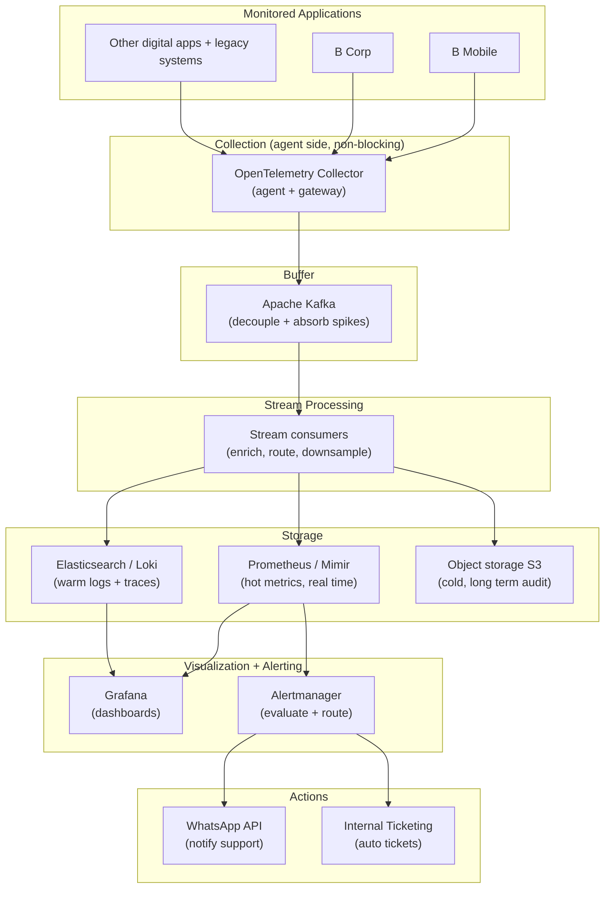
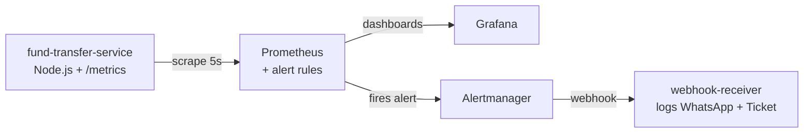

# Ops Vision - B Mobile Fund Transfer Onboarding

This repository onboards the B Mobile "Fund Transfer" flow onto Ops Vision, the internal observability, monitoring, and alerting platform for Bank B.

It contains three parts:

- Part A: Product sense and observability strategy.
- Part B: System architecture design.
- Part C: A running Proof of Concept you can spin up with Docker Compose.

Jump to [How to run the PoC](#how-to-run-the-poc) if you want to see it working first.

---

## Part A: Product Sense and Observability Strategy

### 1. Metric Definition

You monitor a payment flow, so you balance technical health with business value. A transfer can return HTTP 200 and still fail the customer. You measure the customer outcome, not just the server response.

Five metrics cover the Fund Transfer flow.

| # | Metric | Type | Definition | Target |
|---|--------|------|------------|--------|
| 1 | Transfer Success Rate | SLI / SLO | Successful transfers divided by total transfer attempts, per minute. | 99.9% success over 30 days |
| 2 | Transfer Latency p95 and p99 | SLI / SLO | End to end time from request received to funds debited and confirmed. | p95 under 1.5s, p99 under 3s |
| 3 | Failed Transfer Value (Rupiah) | KPI (business) | Total rupiah value stuck in failed transfers per minute. | Alert when a spike exceeds baseline |
| 4 | Throughput (TPS) | KPI (capacity) | Transfer requests per second, split by channel (BI-FAST, RTGS, internal, QRIS). | Track against capacity ceiling |
| 5 | Downstream Dependency Error Rate | SLI | Error rate calling the core banking ledger and the interbank switch. | Under 0.5% |

Why these five:

- Success Rate is the top line health signal. It answers "can customers move money right now."
- Latency drives abandonment. A slow transfer reads as a broken transfer to the customer.
- Failed Transfer Value turns errors into money. A 2% failure rate on high value RTGS transfers hurts more than 2% on small QRIS payments. This metric ranks incidents by business impact.
- Throughput tells you if you approach a capacity wall before it becomes an outage.
- Dependency Error Rate isolates blame. It tells you fast whether the problem sits in B Mobile or in the core ledger or the interbank switch.

The SLO frames the error budget. At 99.9% over 30 days you can fail about 43,000 transfers per million per month before you breach. That budget decides when you page a human.

### 2. Telemetry Strategy

You collect all three signals. Each answers a different question.

Metrics answer "is something wrong and how bad." You emit them from the service in Prometheus format.

- `fund_transfer_requests_total` counter, labels: `status`, `region`, `channel`, `error_code`.
- `fund_transfer_duration_seconds` histogram, labels: `status`, `region`, `channel`. Histograms give you p95 and p99 without shipping every event.
- `fund_transfer_amount_rupiah_total` counter, labels: `region`, `channel`. This is the money view.
- `fund_transfer_in_flight` gauge for concurrent load.
- `fund_transfer_dependency_requests_total` counter, labels: `dependency`, `status`. Tracks calls to the fraud check, core ledger, and interbank switch.
- `fund_transfer_dependency_duration_seconds` histogram, label: `dependency`. Latency of each downstream hop.

Keep label cardinality bounded. Region has 5 values and channel has 4. You never label by customer id or account number. High cardinality kills Prometheus.

Logs answer "what exactly happened to this one transfer." You emit structured JSON, one line per event.

```json
{"ts":"2026-07-13T07:24:54.923Z","service":"fund-transfer","event":"fund_transfer","status":"failed","region":"jakarta","channel":"rtgs","amount_rupiah":1096619,"error_code":"INSUFFICIENT_FUNDS","latency_ms":759,"trace_id":"abc123"}
```

You never log full account numbers, PINs, or OTPs. You mask them. This is a bank.

Traces answer "where did the time go and where did it break." A single transfer touches the mobile gateway, the fraud check, the core ledger, and the interbank switch. You instrument with OpenTelemetry and propagate a `trace_id` across every hop. The `trace_id` also goes into the log line, so an alert links to the exact trace.

The three signals connect. A metric fires the alert. The trace shows which hop broke. The log shows the exact error on the failing transfer.

### 3. Abnormal Pattern Detection

"Normal" for a bank shifts by hour and by day. Payday floods the system. 3am is quiet. A fixed threshold either pages you at payday or misses a real 3am outage. You use three layers.

Layer 1: Static SLO thresholds. These catch clear breaches.

- Global failure ratio above 10% for 30 seconds pages on call.
- p95 latency above 1.5s for 1 minute warns.
- Service scrape target down for 30 seconds pages.

Layer 2: Dimensional breakdown. A global average hides a local fire. If Medan fails at 60% while the other four regions run clean, the global rate might sit at 12% and look like a mild wobble. You evaluate the failure ratio per region and per channel, not just globally. The included rule `fund_transfer:failure_ratio:rate1m_by_region` fires when any single region crosses 30%. This catches "a sudden spike in failed transfers from a specific region" directly.

Layer 3: Baseline and rate of change. For traffic shape you compare against the recent past. Two practical signals:

- Week over week deviation. Compare current throughput to the same time last week. A drop of 50% versus last Monday 10am means customers cannot reach the flow, even if error rate looks fine.
- Sudden slope change. A sharp jump in `error_code="DOWNSTREAM_5XX"` over 2 minutes points at the core ledger, not at customer input like `INSUFFICIENT_FUNDS`. You split alerts by error class so you route system faults to engineers and customer faults to nobody.

Start with Layers 1 and 2 on day one. They are simple, cheap, and hard to get wrong. Add Layer 3 baseline detection once you have two to four weeks of history. This staged path avoids noisy alerts on an empty baseline.

---

## Part B: System Architecture Design

### Design goals

- Ingest telemetry from high throughput apps like B Mobile without slowing the core banking flow.
- Serve a real time dashboard and keep years of history for audit and compliance.
- Evaluate metrics continuously, then drive WhatsApp alerts and internal tickets.

### End to end architecture



PNG version if Mermaid does not render: [docs/architecture.png](docs/architecture.png)

### 1. Ingestion and Processing

The rule is simple: never let telemetry block a customer transaction.

- Emit and forget. The service writes metrics to memory and logs to stdout. It never waits on the monitoring backend. If Ops Vision is down, the transfer still completes.
- Pull for metrics. Prometheus scrapes the `/metrics` endpoint on its own schedule. The app does not push, so a slow backend cannot back-pressure the app.
- Agent side collection. An OpenTelemetry Collector runs as a sidecar or node agent next to the app. It batches, compresses, and ships data. The app process stays light.
- Kafka as the shock absorber. All telemetry lands in Kafka first. B Mobile at payday can produce a burst that no database can absorb in real time. Kafka takes the burst, and consumers drain it at their own pace. If a storage backend restarts, Kafka holds the data until it returns. No data loss.
- Legacy systems. Old enterprise systems that cannot run an OTel SDK get a lightweight agent that tails their logs or scrapes a status endpoint, then publishes into the same Kafka topics. One pipeline, many sources.

### 2. Storage Strategy

You split storage by access pattern. One store cannot serve both a 5 second dashboard refresh and a 7 year audit query cheaply.

| Tier | Store | Retention | Purpose |
|------|-------|-----------|---------|
| Hot | Prometheus, scaled with Mimir or Thanos | 15 to 30 days | Real time dashboards and alert evaluation. Fast queries on recent data. |
| Warm | Elasticsearch or Loki for logs, Tempo for traces | 30 to 90 days | Incident investigation. Search a specific failed transfer and its trace. |
| Cold | Object storage (S3 compatible), Parquet | 1 to 7 years | Compliance and audit. Regulators require long retention. Cheap and rarely read. |

You downsample on the way to cold storage. You do not keep per second resolution for 7 years. You roll it up to per minute or per hour. This cuts cost by orders of magnitude and still satisfies audit.

### 3. Alerting Engine

Prometheus evaluates rules every few seconds against the hot metrics. A rule that stays true for its `for` duration becomes an alert and goes to Alertmanager.

Alertmanager does the routing work:

- Grouping. It bundles related alerts so one incident sends one message, not fifty.
- Deduplication. Repeated firings of the same alert do not spam the team.
- Silencing and inhibition. During planned maintenance you mute alerts. A "service down" alert inhibits the downstream "high latency" noise from the same service.
- Routing by severity. Critical pages on call over WhatsApp and opens a ticket. Warning posts to a channel only.

Alertmanager sends a webhook. In production that webhook hits an integration service that calls the WhatsApp Business API and the internal ticketing API. In this PoC the webhook hits a mock receiver that logs the payload, which proves the contract without needing live bank credentials.

### 4. Tech Stack Selection

| Layer | Choice | Why |
|-------|--------|-----|
| Instrumentation | OpenTelemetry | Vendor neutral standard for metrics, logs, and traces. One SDK, no lock in. Works across polyglot services. |
| Collection | OTel Collector | Runs at the edge. Batches and offloads work from the app. Swappable exporters. |
| Buffer | Apache Kafka | Absorbs high throughput bursts and decouples producers from storage. Replayable and durable. Proven at bank scale. |
| Metrics store | Prometheus, scaled with Mimir or Thanos | Native fit for the pull model and PromQL. Mimir or Thanos give long retention and horizontal scale. |
| Logs and traces | Elasticsearch or Loki, plus Tempo | Full text search on logs and fast trace lookup by `trace_id`. |
| Cold store | S3 compatible object storage | Cheapest durable tier for multi year compliance data. |
| Dashboards | Grafana | Single pane over Prometheus, Loki, and Tempo. Rich panels and alerting. |
| Alert routing | Alertmanager | Grouping, dedup, silencing, and severity routing out of the box. |

The theme is decouple and scale each layer on its own. Kafka isolates spikes. Pull scraping protects the app. Tiered storage matches cost to access. No single component going down takes the flow with it.

---

## Part C: Proof of Concept

The PoC runs a core slice of the architecture above.



PNG version if Mermaid does not render: [docs/poc-flow.png](docs/poc-flow.png)

Components:

- `fund-transfer-service` (Node.js). Simulates the Fund Transfer flow. Generates success and failed transfers continuously across 5 regions and 4 channels. Simulates downstream calls to the fraud check, core ledger, and interbank switch. Exposes Prometheus metrics on `/metrics` and prints structured JSON logs with a `trace_id`. Has admin endpoints to raise the failure rate or break a single region on demand.
- `prometheus`. Scrapes the service every 5 seconds and evaluates 6 recording rules and 5 alert rules.
- `alertmanager`. Routes firing alerts to the webhook receiver.
- `webhook-receiver` (Node.js). Stands in for the WhatsApp API and the Internal Ticketing System. Logs a readable summary and the raw payload.
- `grafana`. Pre-provisioned datasource and a 15 panel dashboard styled as a dark blue operations terminal. No manual setup.

The dashboard panels: success rate, failure ratio, throughput, p95 latency, in-flight, and rupiah value flow as headline tiles, then transfers by status, failure ratio by region, throughput by channel, value flow by channel, latency percentiles, failures by error code, dependency error ratio, a region health table, and dependency p95 latency.

The alerts: `FundTransferHighFailureRate` (global), `FundTransferRegionalFailureSpike` (per region), `FundTransferDependencyErrors` (per downstream), `FundTransferHighLatency`, and `FundTransferServiceDown`.

### How to run the PoC

Requirements: Docker and Docker Compose.

```bash
docker compose up --build
```

Wait about 20 seconds for all containers to start. Then open:

| Service | URL | Notes |
|---------|-----|-------|
| Grafana dashboard | http://localhost:3000 | Anonymous access on. Dashboard: "Ops Vision - B Mobile Fund Transfer" |
| Prometheus | http://localhost:9090 | Check Status then Targets and the Alerts tab |
| Alertmanager | http://localhost:9093 | See active alerts |
| Fund Transfer metrics | http://localhost:8080/metrics | Raw Prometheus metrics |

### How to trigger the alert scenario

The service runs at a 3% baseline failure rate, below the 10% alert threshold, so it stays green at rest.

Option A. Raise the global failure rate above the threshold.

```bash
curl -XPOST http://localhost:8080/admin/failure-rate \
  -H 'content-type: application/json' \
  -d '{"rate":0.8}'
```

Option B. Break a single region to fire the regional alert.

```bash
curl -XPOST http://localhost:8080/admin/failing-region \
  -H 'content-type: application/json' \
  -d '{"region":"jakarta"}'
```

Watch it flow:

1. Grafana "Failure Ratio" panel turns red within seconds.
2. Prometheus Alerts tab shows `FundTransferHighFailureRate` go from Pending to Firing after 30 seconds.
3. Alertmanager forwards the webhook.
4. The webhook receiver logs the alert. View it with:

```bash
docker compose logs -f webhook-receiver
```

You will see output like this:

```
==================== OPS VISION ALERT ====================
alertname       : FundTransferHighFailureRate
severity        : critical
summary         : Fund Transfer failure rate above 10%
description     : Global failure ratio is 42.0% over the last minute. SLO target is 1%.
[WHATSAPP] -> Ops Vision: critical - Fund Transfer failure rate above 10%
[TICKET ] created INC-FundTransferHighFailureRate-jakarta | ...
```

Reset back to healthy:

```bash
curl -XPOST http://localhost:8080/admin/reset
```

The alert resolves on its own. Alertmanager then sends a resolved webhook, which the receiver logs too.

Stop everything:

```bash
docker compose down
```

### Repository layout

```
.
├── README.md                     Part A and Part B, plus run instructions
├── docker-compose.yml            Spins up the entire PoC
├── fund-transfer-service/        Simulated microservice (Part C)
│   ├── server.js
│   ├── package.json
│   └── Dockerfile
├── webhook-receiver/             Mock WhatsApp + Ticketing receiver (Part C)
│   ├── server.js
│   ├── package.json
│   └── Dockerfile
├── prometheus/
│   ├── prometheus.yml            Scrape config
│   └── alert.rules.yml           Recording rules and alerts
├── alertmanager/
│   └── alertmanager.yml          Webhook routing
└── grafana/
    ├── provisioning/             Auto-load datasource and dashboard
    └── dashboards/
        └── fund-transfer.json    The Ops Vision dashboard
```
